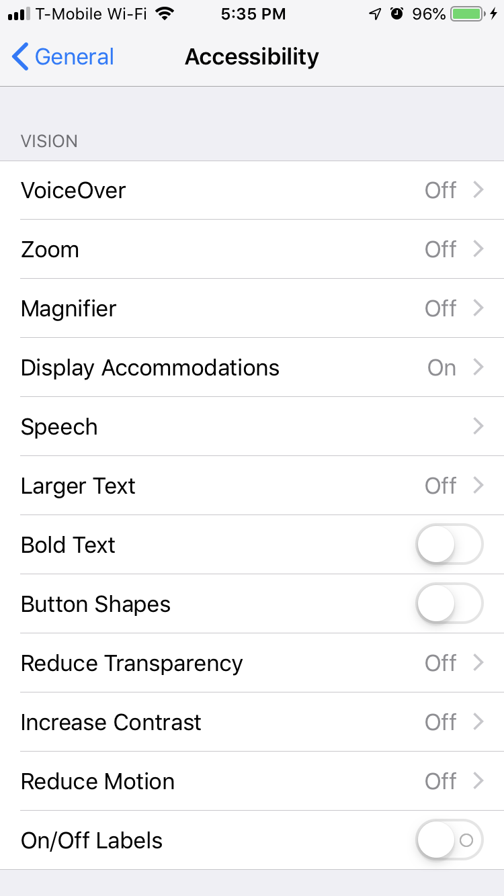
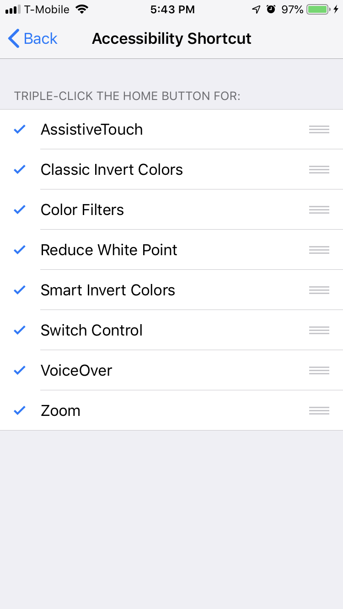
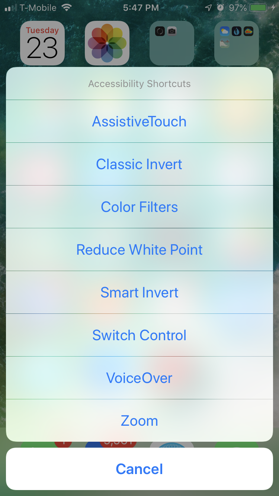
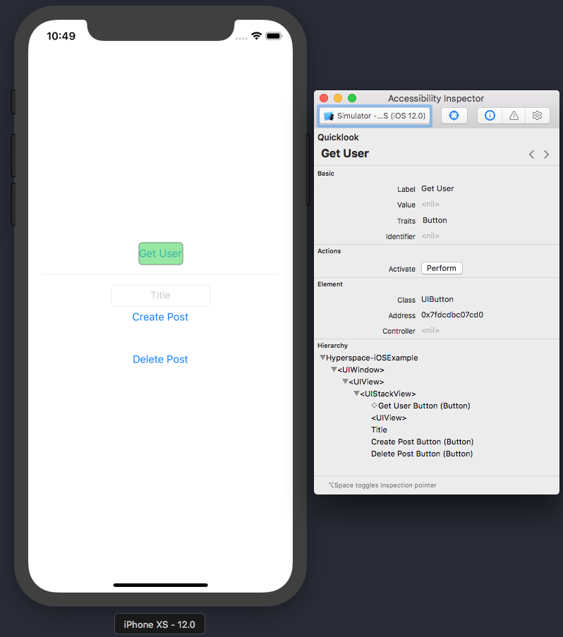
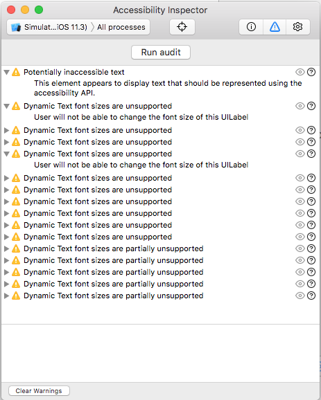
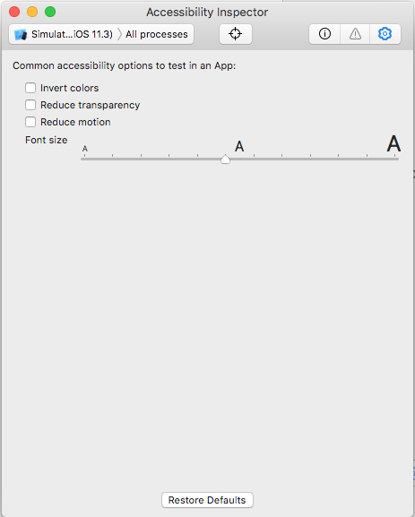

# Accessibility

Making your app accessible is all about making your app as user-friendly as possible to users that have different needs. Most commonly, this refers to making your app usable to blind or low vision users. The goal is to make an interface that is predictable and easy to navigate without depending on (at least not completely) visual queues.

There are [four principles](https://www.w3.org/WAI/WCAG21/Understanding/intro#understanding-the-four-principles-of-accessibility) that contribute to a good accessibility experience:

* **Perceivability**: information and user interface components must be presentable to users in ways they can perceive.
* **Operability**: user interface components and navigation must be operable.
* **Understandability**: information and the operation of the user interface must be understandable.
* **Robustness**: content must be robust enough to be interpreted reliably by a wide variety of user agents, including assistive technologies.

## Accessibility Guidelines

### WCAG

The Web Content Accessibility Guidelines (WCAG) cover a wide range of recommendations for making web content more accessible. While there is no official standard for native mobile apps, we can still use WCAG to inform us on how to make app content more accessible. WCAG categorizes each guideline into one of three levels based on the impact they have on the accessibility experience - A, AA, or AAA. Conforming to the AAA guidelines will provide the most beneficial accessible experience to the most users, but also has the most impact on the visual design of the application. In general, attempting to meet the level A criteria is a step in the right direction for making sure your app provides an acceptable experience.

#### WCAG 2.0

WCAG 2.0 was established in 2008 and, until recently, was the standard websites were measured against to determine their accessibility level. There are many [checklists available](https://www.wuhcag.com/wcag-checklist/) which explain what each guideline means and provide tips for adhering to the guideline.

#### WCAG 2.1

[WCAG 2.1](https://www.w3.org/TR/WCAG21/) was recently released in June of 2018 and builds upon WCAG 2.0, adding additional criteria that modern applications must take into account when implementing accessibility.

## Exploring Accessibility on iOS

Before diving straight into making your app more accessible, take some time to get familiar with the accessibility settings that iOS provides:

1. Open up your Settings app.
2. Navigate to General --> Accessibility.
3. Explore and play around.

*Some of the accessibility options in iOS*

### Accessibility Shortcut

In order to try things out on-the-fly, it can be helpful to configure an "Accessibility Shortcut" that you can activate by triple-clicking the home button. The option can be found at the very bottom of the Accessibility screen. Simply tap on the various accessibility options to enable them on the shortcut menu:

*Accessibility Shortcut configuration*

Then, you can triple-click the home button to turn on/off the various accessibility settings without having to constantly navigate into the Settings app:

*Accessibility Shortcut menu activated*

### Apple's Accessibility Resources

Apple provides extensive [developer documentation on accessibility](https://developer.apple.com/accessibility/) that can be helpful to review before you dive into making your app accessible.

## Tips and Tricks

In order to minimize the amount of custom code you need to write and maintain related to accessibility, it is extremely helpful to be aware of decisions that can affect accessibility while you're building your app.

### Use standard UIKit components where possible

Apple's built-in UI elements are accessible out-of-the box. Avoid creating custom UI when the defaults will work (e.g. don't create a "button" from a `UIView` when a standard `UIButton` will do).

Pay special attention to built-in navigational elements like `UITabBar`, `UINavigationBar`, and `UIToolBar`. New in iOS 11, you can enable your app to allow users to long-press these elements to see a [larger version of the icon and tab name](https://medium.com/bbc-design-engineering/improving-your-apps-accessibility-with-ios-11-db8bb4ee7c9f#ba89).

### Implement `UIAccessibilityContainer` for custom UI components

Custom UI components should implement [UIAccessibilityContainer](https://developer.apple.com/documentation/uikit/accessibility/uiaccessibilitycontainer) methods to make their subviews available to VoiceOver. As of iOS 8, you just need to implement the [`accessibilityElements` property](https://developer.apple.com/documentation/objectivec/nsobject/1615147-accessibilityelements), populating the array with instances of [`UIAccessibilityElement`](https://developer.apple.com/documentation/uikit/uiaccessibilityelement).

### Set titles for images

By default, VoiceOver will read the name of the image file itself. Make sure to give any `UIButton` that uses an image a proper title and annotate each `UIImageView` appropriately.

### Remember to localize accessibility labels

While accessibility labels aren't visually displayed to the user, they should still be considered a component of your app's overall user-facing copy. Make sure to include them as part of your localization process if your app supports multiple languages.

### Support Smart Color Invert

By default, the "Smart Invert" Display Accommodation setting will invert all of the colors in your app. New in iOS 11, you can now tell the system to skip color inversion for components of your app that it doesn't make sense to invert (such as a profile picture). Simply set the [`accessibilityIgnoresInvertColors` property](https://developer.apple.com/documentation/uikit/uiview/2865843-accessibilityignoresinvertcolors) on your views. See [this article](https://duan.ca/2017/12/20/smart-invert-support-for-you-app/) for more information.

### Look at Apple's apps for inspiration

Apple's apps that ship with iOS are generally made to be very accessible. It can be helpful to reference their apps when you need insight into how to solve a particular accessibility problem.

## VoiceOver

The bulk of your accessibility work will likely be interacting with iOS's built-in screen reader called [VoiceOver](https://www.apple.com/accessibility/iphone/vision/#vision-panel).

### Testing with VoiceOver

Keep the following points in mind when testing your app's VoiceOver support:

#### VoiceOver reads any text it can find

Tap everything to see what gets read and what doesn't.

#### VoiceOver changes how taps work

Single taps select an element and double taps perform an action. Scrolling is performed using a three finger drag gesture.

#### VoiceOver reads subviews in order from front to back

That is, subviews higher in the view hierarchy (i.e. ones at the bottom of the list in Interface Builder) get read first. Make sure the order that things are being read makes sense and adjust subview ordering accordingly.

#### VoiceOver might read things differently than you would expect

VoiceOver uses spacing, line breaks, capitalization, and punctuation to try to say things the way they're intended, but it won't always get you the result you want. Adjust accessibility labels accordingly.

### Interacting with VoiceOver

If a feature can't be made accessible without a lot of work, consider adopting an alternate UI when VoiceOver is enabled. This might mean adding:

* Extra navigation
* Extra or alternate messaging to the user
* A different layout

#### Checking the state of VoiceOver

You can query the [`isVoiceOverRunning` property](https://developer.apple.com/documentation/uikit/uiaccessibility/1615187-isvoiceoverrunning) on `UIAccessibility` to check if VoiceOver is currently enabled.

You can also observe the [`voiceOverStatusDidChangeNotification` notification](https://developer.apple.com/documentation/uikit/uiaccessibility/2865862-voiceoverstatusdidchangenotifica) to be notified when the user turns VoiceOver on or off and adjust your UI accordingly.

#### Post UIAccessibilityNotifications when appropriate

If you are implementing a UI that changes frequently or has items that appear and disappear, you can make use of the [`post(notification:argument)` method](https://developer.apple.com/documentation/uikit/uiaccessibility/1615194-post) on `UIAccessibility` to have VoiceOver announce the change. There are many different [accessibility notification types](https://developer.apple.com/documentation/uikit/accessibility/notification_names) so make sure to use the appropriate one for your situation.

## Dynamic Type

Supporting Dynamic Type is another great way to make your app more accessible to low vision users. If you're not using the San Francisco system font, then you'll likely need to work with a designer to define a [Dynamic Type size table](https://developer.apple.com/design/human-interface-guidelines/ios/visual-design/typography/#dynamic-type-sizes) for your font styles. From there, getting a [scaled version of your font](https://developer.apple.com/documentation/uikit/uifont/getting_a_scaled_font) according to the user's Dynamic Type preferences is relatively straightforward. WWDC 2017 Session 245 - [Building Apps with Dynamic Type](https://developer.apple.com/videos/play/wwdc2017/245/) is also another great resource to learn more about Dynamic Type.

If you're targeting iOS 11 and above, Apple also makes it easy for your fonts to [scale automatically](https://developer.apple.com/documentation/uikit/uifont/scaling_fonts_automatically).

## Testing Accessibility

For the most part, testing accessibility is a very manual and time consuming process. Luckily, Apple does provide some tools to make testing and debugging accessibility issues easier.

### The Accessibility Inspector

macOS ships with a tool called the [Accessibility Inspector](https://developer.apple.com/library/archive/documentation/Accessibility/Conceptual/AccessibilityMacOSX/OSXAXTestingApps.html) which exposes the information that your app exposes to tools like VoiceOver. Run your app in the simulator and use the Accessibility Inspector to gain insight into the accessibility of your app.

*Accessibility Inspector inspection*

The Accessibility Inspector also provides a built-in auditing tool to help you identify potential accessibility issues.

*Accessibility Inspector audit tool*

Another neat feature of the Accessibility Inspector is the ability to toggle common accessibility options on-the-fly. This can be a huge time saver for testing things like Dynamic Type.

*Accessibility Inspector settings*
