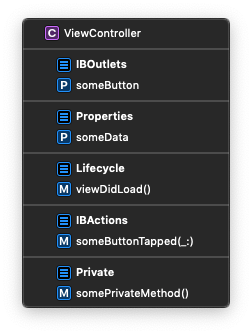

# Swift Style Guide

This iOS Swift Style Guide is intended to define the styles and guidelines used by Bottle Rocket iOS developers when writing code in Swift. The main goal is to promote a clean, consistent style of writing code that ensures the maintainability, consistency and ease of developer collaboration within our organization. All code written at Bottle Rocket should adhere to the standards defined herein, unless a specific need to violate these guidelines arises.

Where any ambiguity exists in the standards, we default to the Apple standards and guidelines. Apple conventions are strongly encouraged.

For any styling concerns not covered by our [SwiftLint configuration](https://gist.github.com/tylermilner/f33e33e3b4f23d8c6b2fdd4f87af98a1), refer to the notes below. If you see something missing, then please open an issue or pull request!

## Architecture

### Class Structure

* Classes should follow a consistent structure. Properties should be declared first, followed by initializers, subclass overrides, public methods, and finally private methods.
* Extensions on a custom type should generally be defined in the same source file below the definition of the type itself.
* Extensions on Apple's types should be placed in their own file, typically inside of an "Extensions" folder in your project.

#### Do

```swift
class SomeClass: BaseClass {
    private static let privateStaticProperty = // ...
    static let staticProperty = // ...

    private let privateProperty = // ...
    let publicProperty = // ...

    init() {
        // ...
    }

    override func someFunc() {
        super.someFunc()
        // ...
    }

    func publicMethod() {
        // ...
    }

    private func privateMethod() {
        // ...
    }
}

extension SomeClass: SomeProtocol {
    // ...
}
```

#### Do Not

```swift
extension SomeClass: SomeProtocol {
    // ...
}

class SomeClass: BaseClass {
    let publicProperty = // ...

    override func someFunc() {
        super.someFunc()
        // ...
    }

    init() {
        // ...
    }

    private let privateProperty = // ...

    private func privateMethod() {
        // ...
    }

    func publicMethod() {
        // ...
    }
}
```

### Access Control

* Be restrictive. Always default to the most restrictive access control level possible - `private`. Not only is this a good encapsulation practice in general, but it also allows the Swift compiler to [automatically perform additional optimizations](https://github.com/apple/swift/blob/master/docs/OptimizationTips.rst#advice-use-private-and-fileprivate-when-declaration-does-not-need-to-be-accessed-outside-of-file).
* Avoid overspecification. Prefer relying on the implicit `internal` access control to explicitly declaring something as `internal`.

#### Do

```swift
class SomeClass {
    private var somePrivateProperty: String?
    var someInternalProperty: String?

    func someInternalMethod() {
        // ...
    }

    private func somePrivateMethod() {
        // ...
    }
}
```

#### Do Not

```swift
public class SomeClass {
    var somePrivateProperty: String?
    var someInternalProperty: String?

    public func someInternalMethod() {
        // ...
    }

    func somePrivateMethod() {
        // ...
    }
}
```

### High-level Methods

* Keep high-level entry points clean ( `init()`, `viewDidLoad()`, `application(_:didFinishLaunchingWithOptions:)`, etc.). These methods should primarily consist of calls into other methods. This forces you to group related code together and helps to prevent the pollution of high-level methods with implementation details.

#### Do

```swift
class ViewController: UIViewController {
    @IBOutlet private var stackView: UIStackView!
    @IBOutlet private var textField: UITextField!

    override func viewDidLoad() {
        super.viewDidLoad()

        setupView()
        setupTextField()
        setupSubmitButton()
    }

    private func setupView() {
        view.backgroundColor = .gray
    }

    private func setupTextField() {
        textField.placeholder = "Placeholder"
        textField.layer.cornerRadius = 5
        textField.delegate = self
    }

    private func setupSubmitButton() {
        let submitButton = UIButton(type: .system)
        submitButton.setTitle("Submit", for: .normal)
        submitButton.layer.cornerRadius = 5
        submitButton.layer.masksToBounds = true
        submitButton.isEnabled = false
        stackView.addArrangedSubview(submitButton)
    }
}
```

#### Do Not

```swift
class ViewController: UIViewController {
    @IBOutlet private var stackView: UIStackView!
    @IBOutlet private var textField: UITextField!

    override func viewDidLoad() {
        super.viewDidLoad()

        view.backgroundColor = .gray

        textField.placeholder = "Placeholder"
        textField.layer.cornerRadius = 5
        textField.delegate = self

        let submitButton = UIButton(type: .system)
        submitButton.setTitle("Submit", for: .normal)
        submitButton.layer.cornerRadius = 5
        submitButton.layer.masksToBounds = true
        submitButton.isEnabled = false
        stackView.addArrangedSubview(submitButton)
    }
}
```

### Forced Unwrapping

* Optionals are what inherently allow apps written in Swift to achieve a much lower crash rate than their counterpart written in Objective-C.
* [Forced unwrapping](https://docs.swift.org/swift-book/LanguageGuide/TheBasics.html#ID332) of optionals is not permitted. Instead, proper error handling should be employed through the use of a safe unwrapping mechanism like `guard`, `if let`, [optional chaining](https://docs.swift.org/swift-book/LanguageGuide/OptionalChaining.html), or [nil-coalescing](https://docs.swift.org/swift-book/LanguageGuide/BasicOperators.html#ID72).

#### Do

```swift
var someOptional: String?

guard let text = someOptional else { return }
titleLabel.text = text
```

```swift
var someOptional: String?

if let text = someOptional {
    titleLabel.text = text
}
```

```swift
var someOptional: String?

titleLabel.text = someOptional ?? "default value"
```

#### Do Not

```swift
var someOptional: String?

titleLabel.text = someOptional!
```

### Forced Casting

* For the same reasons outlined above regarding forced unwrapping, [forced casting](https://docs.swift.org/swift-book/LanguageGuide/TypeCasting.html#ID341) is not permitted.

#### Do

```swift
func parseParameters(from dictionary: [String: Any]) {
    guard let firstName = dictionary["first_name"] as? String,
          let lastName = dictionary["last_name"] as? String else { return }
    // ...
}
```

#### Do Not

```swift
func parseParameters(from dictionary: [String: Any]) {
    let firstName = dictionary["first_name"] as! String
    let lastName = dictionary["last_name"] as! String
    // ...
}
```

### Implicitly Unwrapped Optionals

* [Implicitly unwrapped optionals](https://docs.swift.org/swift-book/LanguageGuide/TheBasics.html#ID334) should be avoided as well. In general, there are only certain situations where their use is acceptable:
    * IBOutlets - Unconnected outlets are development errors which, once correct, will never fail due to dynamic circumstances.
    * Unit testing - The system under test (or its dependencies) when it's created/destroyed as part of the `XCTestCase` lifecycle (i.e. `setUp()` and `tearDown()`).

#### Do

```swift
class ViewController: UIViewController {

    var requiredData: [String: Any]?

    override func viewDidLoad() {
        super.viewDidLoad()

        guard let requiredData = requiredData else {
            assertionFailure("Required data was not set before presenting \(self)")
            return
        }

        processData(requiredData)
    }

    private func processData(_ data: [String: Any]) {
        // ...
    }
}
```

#### Do Not

```swift
class ViewController: UIViewController {

    var requiredData: [String: Any]!

    override func viewDidLoad() {
        super.viewDidLoad()

        processData(requiredData)
    }

    private func processData(_ data: [String: Any]) {
        // ...
    }
}
```

### Swift Types

* Prefer Swift's native types (`Int`, `Float`, `String`, etc.) to the older Objective-C types (`NSInteger`, `CGFloat`, `NSString`, etc.). You can always bridge Swift's native types into Objective-C types whenever necessary.

#### Do

```swift
var height: Float = 25.0
let numberOfRows: Int = 5
```

```swift
let basePath = "https://bottlerocketstudios.com" // String
let fullPath = (basePath as NSString).appendingPathComponent("contact") // String
```

#### Do Not

```swift
var height: CGFloat = 25.0
let numberOfRows: NSInteger = 5
```

```swift
let basePath = NSString(string: "https://bottlerocketstudios.com") // NSString
let fullPath = basePath.appendingPathComponent("contact") // String
```

### Extensions and Protocol Conformance

* Prefer using extensions to make classes conform to protocols rather than directly implementing them at the class definition.
* Avoid using extensions to create separations between various parts of your code (e.g. private methods, lifecycle methods, etc.). Use `MARK: -` comments instead.

#### Do

```swift
class ViewController: UIViewController {

    // MARK: - Lifecycle

    override func viewDidLoad() {
        super.viewDidLoad()
        // ...
    }

    override func viewWillAppear(_ animated: Bool) {
        super.viewWillAppear(animated)
        // ...
    }

    override func viewWillDisappear(_ animated: Bool) {
        super.viewWillDisappear(animated)
        // ...
    }

    // MARK: - Private

    private func somePrivateMethod() {
        // ...
    }

    private func someOtherPrivateMethod() {
        // ...
    }
}

extension ViewController: UITableViewDataSource {
    // ...
}

extension ViewController: UITableViewDelegate {
    // ...
}
```

#### Do Not

```swift
class ViewController: UIViewController, UITableViewDataSource, UITableViewDelegate {

    override func viewDidLoad() {
        super.viewDidLoad()
        // ...
    }

    func tableView(_ tableView: UITableView, numberOfRowsInSection section: Int) -> Int {
        // ...
    }

    func tableView(_ tableView: UITableView, cellForRowAt indexPath: IndexPath) -> UITableViewCell {
        // ...
    }
}

extension ViewController {

    override func viewWillAppear(_ animated: Bool) {
        super.viewWillAppear(animated)
        // ...
    }

    override func viewWillDisappear(_ animated: Bool) {
        super.viewWillDisappear(animated)
        // ...
    }
}

extension ViewController {

    private func somePrivateMethod() {
        // ...
    }

    private func someOtherPrivateMethod() {
        // ...
    }
}
```

### IBOutlets

* Default to `private`. This keeps things better encapsulated, but still allows you to access the outlets in Interface Builder.
* Default to a **strong** reference. There is [no need](https://stackoverflow.com/a/31395938) to make IBOutlets `weak` in modern iOS code.
* Suffix the name with they type of object (e.g. `title**Label**`, `logo**ImageView**`).
* Use the most specific type suffix (e.g. `profileImageView` over `profileView`).

#### Do

```swift
@IBOutlet private var logoImageView: UIImageView!
```

#### Do Not

```swift
@IBOutlet var logo: UIImageView!
```

```swift
@IBOutlet var logoView: UIImageView!
```

### Lazy Loading

* Make use of Swift's `lazy` keyword to lazy load properties rather than performing the setup logic in hooks like `init()` or `viewDidLoad()`.
* Take extra care to use `lazy` for objects that are expensive to create (e.g. `NSDateFormatter`).

#### Do

```swift
class ViewController: UIViewController {

    private lazy var activityIndicator: UIActivityIndicatorView = {
        let activityIndicator = UIActivityIndicatorView(style: .whiteLarge)
        view.addSubview(activityIndicator)
        return activityIndicator
    }()

    override func viewDidLoad() {
        super.viewDidLoad()

        showSpinner()
        loadDataFromNetwork()
    }

    private func showSpinner() {
        activityIndicator.startAnimating()
    }

    private func loadDataFromNetwork() {
        // ...
    }
}
```

```swift
class SomeTableViewCell: UITableViewCell {
    private lazy var dateFormatter: DateFormatter = {
        let formatter = DateFormatter()
        // Configure formatter
        return formatter
    }()

    func configureWithDate(_ date: Date) {
        textLabel?.text = dateFormatter.string(from: date)
        // ...
    }
}
```

#### Do Not

```swift
class ViewController: UIViewController {

    private var activityIndicator: UIActivityIndicatorView?

    override func viewDidLoad() {
        super.viewDidLoad()

        if activityIndicator == nil {
            let activityIndicator = UIActivityIndicatorView(style: .whiteLarge)
            view.addSubview(activityIndicator)
            self.activityIndicator = activityIndicator
        }
        activityIndicator?.startAnimating()

        loadDataFromNetwork()
    }

    private func loadDataFromNetwork() {
        // ...
    }
}
```

```swift
class SomeTableViewCell: UITableViewCell {

    func configureWithDate(_ date: Date) {
        let dateFormatter = DateFormatter()
        // Configure formatter

        textLabel?.text = dateFormatter.string(from: date)
        // ...
    }
}
```

### Constants

* Keep the scope of constants as small as possible.
* If a constant is only needed for a class, it should live in that class. Another option would be to make it a `static let` property of a `fileprivate` enum inside of the same source file.
* App-wide constants should be kept outside of the global namespace. Instead, make them `static let` properties on an enum. Using a struct would generally be okay as well, but an enum offers an additional protection against accidental instantiation.

#### Do

```swift
enum Constants {
    static let globalConstant = // ...
}
```

```swift
class ViewController: UIViewController {
    private let someConstant = // ...

    // ...
}
```

```swift
class SomeObject {
    enum ObjectConstants {
        static let someConstant = // ...
    }
}
```

#### Do Not

```swift
import UIKit

let globalConstant = // ...
let otherGlobalConstant = // ...

@UIApplicationMain
class AppDelegate: UIResponder, UIApplicationDelegate {
    // ...
}
```

```swift
import UIKit

let someConstant = // ...

class ViewController: UIViewController {
    // ...
}
```

### Enum Cases

* Enum cases should be declared on separate lines instead of declaring multiple cases on a single line.

#### Do

```swift
enum MyEnum {
    case caseOne
    case caseTwo
    case caseThree
}
```

#### Do Not

```swift
enum MyEnum {
    case caseOne, caseTwo, caseThree
}
```

### Inter-function Spacing

* There should be exactly one line of whitespace between function declarations.

#### Do

```swift
open func cancel(with error: Error) {  
    // ...
}

open func cancel(withErrors errors: [Error]) {
    // ...
}
```

#### Do Not

```swift
open func cancel(with error: Error) {  
    // ...
}
open func cancel(withErrors errors: [Error]) {
    // ...
}
```

### Extension spacing

* There should be exactly one line of whitespace after the opening declaration for an extension.

#### Do

```swift
extension Operation {

    open func add(condition: Condition) {
        // ...
    }

    open func add(observer: Observer) {
        // ...
    }
}
```

#### Do Not

```swift
extension Operation {
    open func add(condition: Condition) {
        // ...
    }

    open func add(observer: Observer) {
        // ...
    }
}
```

### Immutability

* Prefer immutable variable declarations over mutable declarations whenever possible. This not only allows us to make reasonable assumptions about the use of that variable in code, but also assists the complier.

#### Do

```swift
let foo = ...
```

#### Do Not

```swift
var foo = ...
```

### Singletons

* Make sure the class you are using this for actually needs to be a singleton. Odds are, it doesn't.
* Prefer the name `shared` for the singleton instance as opposed to `sharedInstance`, `sharedClassName`, etc.
* While there are several ways to create a singleton in Swift, the most concise method described below should be preferred on all Bottle Rocket projects.

#### Do

```swift
class MyClass() {
    static let shared = MyClass()

    init() {
        // ...
    }
}
```

#### Do Not

```swift
class MyClass() {
    private static let shared: MyClass = {
        // ...
    }

    init() {
        // ...
    }
    
    static func shared() -> MyClass {
        return shared
    }
}
```

### Parameter Validation

* Use optionals to enforce validation of input parameters. Prefer using `guard` statements to verify parameters and return early instead of nesting `if let` statements.

#### Do

```swift
func cachedImage(url: URL?) -> UIImage? {
    guard let absoluteString = url?.absoluteString, let data = imageCache.object(forKey: absoluteString) as? Data else { return nil }

    return UIImage(data: data)
}
```

#### Do Not

```swift
func cachedImage(url: URL?) -> UIImage? {
    if let absoluteString = url?.absoluteString {
        if let data = imageCache.object(forKey: absoluteString) as? Data {
            return turnImageIntoDeliciousSandwich(UIImage(data: data))
        }
    }

    return nil
}
```

### Array and Dictionary Accessors

* When you're accessing an element in a dictionary or array, prefer the square bracket operators over `objectAtIndex` (and similar) methods. These operators make for readable, straightforward code.
* In addition, prefer the use of the `first`, `last`, and `isEmpty` properties on arrays.

#### Do

```swift
let theElement = array[14]

guard !array.isEmpty else { return }
guard let theFirstOne = array.first else { return }
guard let theLastOne = array.last else { return }
```

#### Do Not

```swift
let theElement = array.object(at: 14)

guard array.count > 0 else { return }
let theFirstOne = array[0]
let theLastOne = array[array.count - 1]
```

### Magic Numbers

* Avoid hard-coding constants for values that can be calculated for easier readability.
* Document any other hard-coded values with a comment.

#### Do

```swift
let myColor = UIColor(red: 230 / 255, green: 220 / 255, blue: 225 / 255, alpha: 1)
```

```swift
let timeUntilRefresh = 60 * 60 * 24 * 2 // 2 days
```

#### Do Not

```swift
let myColor = UIColor(red: 0.901961, green: 0.862745, blue: 0.882353, alpha: 1)
```

```swift
let timeUntilRefresh = 172800 // 2 days
```

## Syntactic Sugar

### Type Inference

* Omit type information whenever possible. Let the compiler infer the type of a constant, variable, parameter, etc. This not only applies to enums, but also the majority of static properties (e.g. `UIColor.black` becomes simply `.black`).

#### Do

```swift
UIView.animate(withDuration: 0.1, delay: 0.0, options: .curveEaseInOut, animations: {
    // ...
}) { _ in
    // ...
}
```

```swift
let someBool = true
```

```swift
let music: Genre = .metal
```

#### Do Not

```swift
UIView.animate(withDuration: 0.1, delay: 0.0, options: UIView.AnimationOptions.curveEaseInOut, animations: {
    // ...
}) { _ in
    // ...
}
```

```swift
let someBool: Bool = true
```

```swift
let music: Genre = Genre.metal
```

### Swift's Generic Types

* Prefer the syntactic sugar variants of Swift's collection and optional types as opposed to the full generics syntax.

#### Do

```swift
var shoppingList: [String]
```

```swift
var itemCount: [String: Int]
```

```swift
var phoneNumber: String?
```

#### Do Not

```swift
var shoppingList: Array<String>
```

```swift
var itemCount: Dictionary<String, Int>
```

```swift
var phoneNumber: Optional<String>
```

### `$0` Syntax

* The `$0` shorthand syntax that's available on collection operations is generally fine to use, but you might consider using a named variable if implementing a very complicated operation. Always make sure that other people (including your future self) can easily understand what the `$0` represents when they read your code.

#### Do

```swift
static func generateRawQueryParametersString(from queryParameters: [URLQueryItem]) -> String {
    return queryParameters.reduce("") { (partialResult, queryItem) -> String in
        let nextPartialResult = (partialResult.isEmpty ? "" : "\(partialResult)&")

        guard let queryValue = queryItem.value else {
            return nextPartialResult + "\(queryItem.name)"
        }

        return nextPartialResult + "\(queryItem.name)=\(queryValue)"
    }
}
```

#### Do Not

```swift
static func generateRawQueryParametersString(from queryParameters: [URLQueryItem]) -> String {
    return queryParameters.reduce("") {
        return ($0.isEmpty ? "" : "\($0)&").appending($1.value != nil ? "\($1.name)=\($1.value ?? "")" : $1.name)
    }
}
```

## Naming

### Acronyms in Variable Names

* Acronyms should always appear in all caps, unless the acronym starts at the beginning of the variable name.

#### Do

```swift
let resultFromAPI = parseResponse()
```

```swift
let apiResult = parseResponse()
```

#### Do Not

```swift
let resultFromApi = parseResponse()
```

```swift
let APIResult = parseResponse()
```

### Class Prefixes

* Do not prefix Swift types. Due to Swift offering proper namespacing, this convention from Objective-C is no longer necessary.
* If you do need to expose a class to Objective-C and want to avoid namespace collisions, you can use the `@objc(...)` attribute to specify a class name that includes the prefix, but will only be visible to Objective-C code.

#### Do

```swift
class MyAwesomeSwiftClass {
    // ...
}
```

```swift
@objc(BRSMyAwesomeSwiftClass) class MyAwesomeSwiftClass {
    // ...
}
```

#### Do Not

```swift
class BRSMyAwesomeSwiftClass {
    // ...
}
```

### Underscores in Variable Names

* Variable/property names should not be prefixed with an `_`, even if used privately. Variables should use headless camel case and not begin with a symbol or number.

#### Do

```swift
struct MyStruct {  
    private var backingInteger = 0
    var mutableInteger: Int {
        get {
            return backingInteger
        } set {
            backingInteger = newValue
        }
    }
}
```

#### Do Not

```swift
struct MyStruct {    
    private var _mutableInteger = 0
    var mutableInteger: Int {
        get {
            return _mutableInteger
        } set {
            _mutableInteger = newValue
        }
    }
}
```

## Comments

### `MARK:` Comments

* Make extensive use of `MARK:` comments ( `#pragma mark` in Obj-C) to break your class up into sections. This forces you to group related code together, making it easier to browse through files.
* Add a dash after the `MARK:` so that Xcode's method browser will include nice visual separators:



#### Do

```swift
class ViewController: UIViewController {

    // MARK: - IBOutlets

    @IBOutlet private var someButton: UIButton!

    // MARK: - Properties

    private var someData: Data?

    // MARK: - Lifecycle

    override func viewDidLoad() {
        super.viewDidLoad()
        // ...
    }

    // MARK: - IBActions

    @IBAction private func someButtonTapped(_ button: UIButton) {
        // ...
    }

    // MARK: - Private

    private func somePrivateMethod() {
        // ...
    }
}
```

#### Do Not

```swift
class ViewController: UIViewController {

    @IBOutlet private var someButton: UIButton!
    private var someData: Data?

    override func viewDidLoad() {
        super.viewDidLoad()
        // ...
    }

    @IBAction private func someButtonTapped(_ button: UIButton) {
        // ...
    }

    // MARK: Private

    private func somePrivateMethod() {
        // ...
    }
}
```
