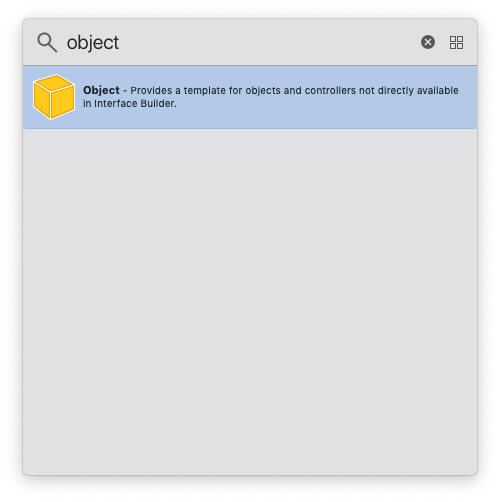

# Interface Building

## Interface Builder vs Code

Interface Builder is the preferred mechanism for creating UI components, rather than creating UI from scratch in code. There are several reasons for this:

* Less code to write and maintain.
* No need to bring in a third party solution to make manually writing constraints tolerable.
* Easier to get a visual sense of the component, especially when utilizing size classes. This also allows you to iterate faster.

### Objects in Interface Builder

It's also possible to include objects inside of storyboards or xibs:

This does potentially reduce the need for some boilerplate code in your view controller, but we **do not** recommend instantiating objects in Interface Builder for the following reasons:

* It's not a standard practice in the iOS community.
* Interface Builder is primarily UI-focused. Using it to instantiate non-UI objects doesn't make much sense.
* It makes proper dependency injection almost impossible, often negating the code reduction benefits of instantiating the object in Interface Builder in the first place.

## Storyboards vs Xibs

### When to use storyboard vs xib

Storyboards should be preferred to xibs for things like:

* Creating view controllers
* Creating table/collection view prototype cells
* Extra views that are programmatically inserted/managed in the view hierarchy (via the [scene dock](https://medium.com/if-let-swift-programming/interface-builder-scene-dock-extra-views-26cef5fe363b))

For the most part, xib use should be restricted to views that are common to multiple screens within an app. Generic table or collection view cells are a good example of this.

### Dealing with merge conflicts

In general, large storyboard/xib merge conflicts can be avoided if a little bit of thought is put into the distribution of work:

* Don't allow multiple people to modify UI on the same screen in the same storyboard at the same time.
* Don't be afraid to have multiple storyboard files. Group related screens together by storyboard and make use of [storyboard references](https://useyourloaf.com/blog/refactoring-with-storyboard-references/) when necessary.

## Auto Layout

### vs Springs and Struts

Prefer Auto Layout to springs and structs or manual frame math. With the amount of variation in screen sizes today, there's a good reason Apple moved us away from this a long time ago! This also applies to performing animations. Many UI animations can be implemented by manipulating layout constraints, and these will be much safer than with direct frame math.

### Creating Constraints Programmatically vs Interface Builder

Auto Layout constraints should be configured in Interface Builder whenever possible. Creating constraints in code should be an absolute last resort. And when necessary, prefer using the highest level of abstraction available to you:

* [Stack Views](https://developer.apple.com/documentation/uikit/uistackview) - you should start here since it handles the constraint creation for you.
* [UtiliKit](https://github.com/BottleRocketStudios/iOS-UtiliKit/blob/master/Sources/UtiliKit/General/UIView%2BExtensions.swift) - we have several convenience methods via an extension on `UIView`. If you feel there is something missing, please open a pull request!
* [Layout Anchors](https://developer.apple.com/library/archive/documentation/UserExperience/Conceptual/AutolayoutPG/ProgrammaticallyCreatingConstraints.html#//apple_ref/doc/uid/TP40010853-CH16-SW5) - this gives you a lot of control, but still keeps things relatively high-level.
* [`NSLayoutConstraint`](https://developer.apple.com/library/archive/documentation/UserExperience/Conceptual/AutolayoutPG/ProgrammaticallyCreatingConstraints.html#//apple_ref/doc/uid/TP40010853-CH16-SW8) - more verbose than layout anchors, but can be necessary sometimes.
* [Visual Format Language](https://developer.apple.com/library/archive/documentation/UserExperience/Conceptual/AutolayoutPG/VisualFormatLanguage.html) - there shouldn't be a need to write constraints this way.

Note the lack of recommendation for using third party constraint libraries. While some of them do manage to get the constraint syntax to be quite concise, we find that it's best to just stick with Apple's technologies and avoid adding another dependency.

Also make sure to keep constraint creation and configuration code tucked away into its own method(s). Avoid polluting high-level methods like `viewDidLoad()` with a bunch of constraint setup or management.

### Auto Layout Warnings and Errors

These should be resolved as soon as they appear in your debugger window. If your layout is causing these kinds of warnings and errors, realize that they may start a cascading effect that will prohibit your app from rendering properly even if everything looks OK at first. Along those same lines, even if everything is working properly today, know that future iOS SDK updates could cause your app to have problems down the road.

The reduction of [run-time console noise](../Build%20Warnings%20and%20Errors/Build%20Warnings%20and%20Errors.md#console-noise) is also a huge benefit to taking care of these issues before they become real problems. Consider setting up some [project-wide breakpoints](../Build%20Warnings%20and%20Errors/Build%20Warnings%20and%20Errors.md#project-breakpoints) to help your team identify these errors early.

### Named Constraints

Whenever possible, provide a name for your layout constraint; this will make locating it in the debugger much simpler.

## Sensible Defaults

When creating interfaces, either programmatically or in Interface Builder, it is good to give fields and controls sensible default values. It is possible that when there, in the event of an error or a lost network connection, a user might see values that were meant to be replaced by live data, so the contents of those fields need to make sense.

More often than not, the best default value is blank. If things go completely wrong the worst case scenario is an empty screen as opposed to nonsense values or meaningless stub text.

When blank doesn’t work, simple descriptions or “loading...” will often do, but bear in mind that changing some text from “loading...” to it’s proper contents doesn’t animate well. It would be better to just use an activity indicator and go from blank to populated.

For collection view and table view cells, it is a good idea to blank out any labels or image views in `prepareForReuse()`.
