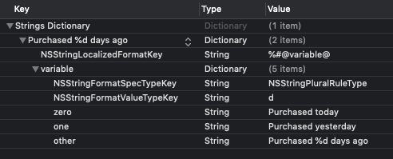
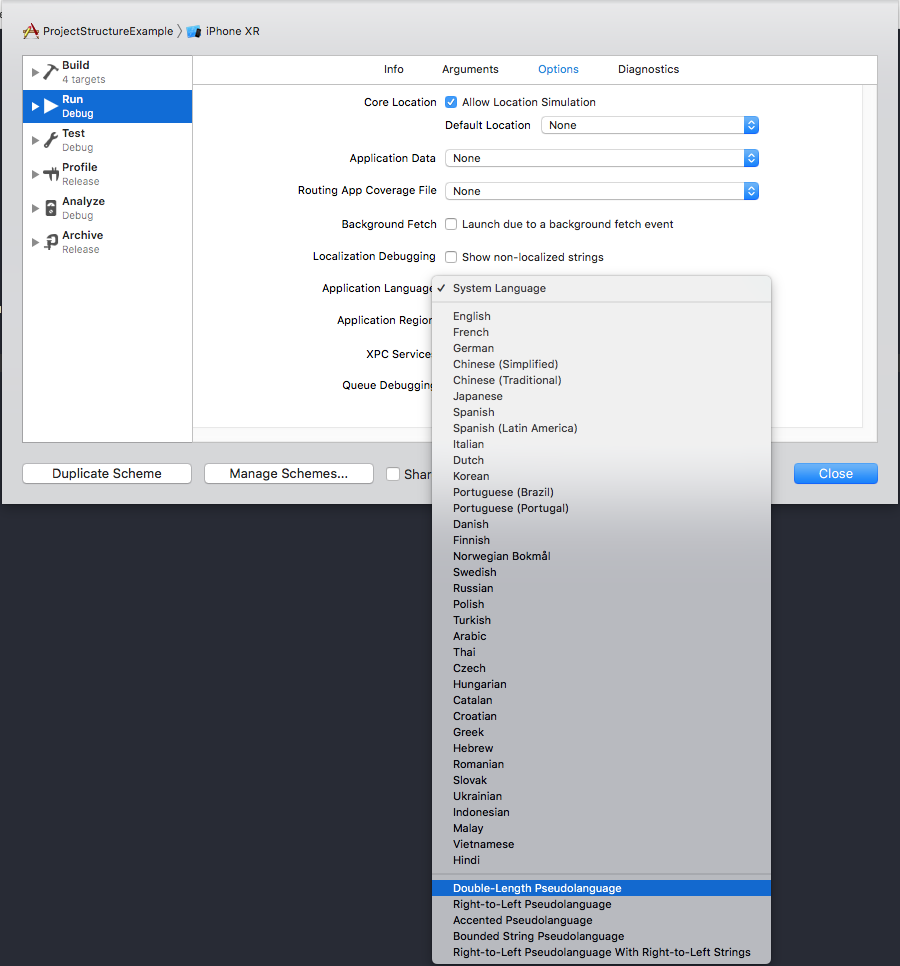

# Internationalization and Localization

## Internationalization vs Localization

There is a slight distinction between internationalization and localization:

* Internationalization - the process of making your app able to adapt to different languages, regions, and cultures.
* Localization - the process of translating your app into multiple languages.

You must first internationalize your app before you can take advantage of localization. Together, internationalization and localization allow you to better serve users around the globe by making your app appear as though it was built natively for whatever language and region it's being used in.

## Localized Strings

### Use `NSLocalizedString` for all user-facing copy

Using the [`NSLocalizedString()` macro](https://developer.apple.com/documentation/foundation/nslocalizedstring) from the start of a project will ensure that supporting additional languages can be done in the future with minimal effort.

### Use quality comments when invoking `NSLocalizedString()`

The `comment` parameter of `NSLocalizedString()` is used by translators when you add additional languages to your app. Adding some context here can make the job of the translators easier and help the overall quality of the translations. You should describe where the string is used and what its purpose is rather than simply echoing the string itself.

#### Do

```swift
NSLocalizedString("Back", comment: "Title for generic back buttons used throughout the app.")
```

#### Do Not

```swift
NSLocalizedString("Back", comment: "Back")
```

### Avoid manually editing `.strings` files

Once you import translations into your app, Xcode will automatically generate a `Localizable.strings` file for the various languages you support. Avoid editing this file by hand since your edits might get blown away the next time you go through the localization export/import process.

### Consolidate all user-facing copy into a single struct/file

Consolidating all user-facing copy into a `LocalizedStrings` struct (inside of a `LocalizedStrings.swift` file) makes it easier to change and audit user-facing copy.

#### Example `LocalizedStrings.swift`

```swift
struct LocalizedStrings {

    // MARK: - General

    struct General {
        static let back = NSLocalizedString("Back", comment: "Title for generic back buttons used throughout the app.")
        static let next = NSLocalizedString("Next", comment: "Title for generic next buttons used throughout the app.")
        // ...
    }

    // MARK: - Account

    struct Account {
        // ...
    }

    // MARK: - Home

    struct Home {
        static let welcome = NSLocalizedString("Welcome, %@", comment: "Home screen welcome message. Translations should preserve the '%@' characters.")
        // ...
    }

    // MARK: - Login

    struct Login {
        // ...
    }
}
```

#### Example `LocalizedStrings.swift` usage

```swift
nextButton.setTitle(LocalizedStrings.General.next, for: .normal)
```

### Placeholders in localized strings

When using placeholders in localized strings, it can be helpful to remind translators that the `%@` placeholder should be included in the translations (see the `comment` parameter for `LocalizedStrings.Home.welcome` in the example above). From here, you can use the `String(format:)` initializer to populate the string appropriately:

```swift
welcomeLabel.text = String(format: LocalizedStrings.Home.welcome, user.name)
```

### Utilize `.stringsdict` for pluralization

Not all languages handle pluralization of words in the same way. **Do not** hard-code pluralization logic into your app to programmatically select a word's plurality. Instead, you should use a [`.stringsdict` file](https://developer.apple.com/library/archive/documentation/MacOSX/Conceptual/BPInternational/StringsdictFileFormat/StringsdictFileFormat.html) to handle pluralization.

#### Do

```swift
return NSLocalizedString("Purchased %d days ago", comment: "Purchase made '%d' days ago.")
```

With corresponding `Localizable.stringsdict`:



#### Do Not

```swift
if daysSincePurchase < 1 {
    return NSLocalizedString("Purchased today", comment: "Purchase made today.")
} else if daysSincePurchase < 2 {
    return NSLocalizedString("Purchased yesterday", comment: "Purchase made yesterday.")
} else {
    return NSLocalizedString("Purchased %d days ago", comment: "Purchase made '%d' days ago.")
}
```

## Respect the device's locale

Use the [formatters built-in to Foundation](https://developer.apple.com/documentation/foundation/formatter#overview) to format values according to the device's current locale. Some of the more common ones include:

* [`DateFormatter`](https://developer.apple.com/documentation/foundation/dateformatter) - localized representations of dates and times.
* [`DateComponentsFormatter`](https://developer.apple.com/documentation/foundation/datecomponentsformatter) - localized representations of quantities of time.
* [`DateIntervalFormatter`](https://developer.apple.com/documentation/foundation/dateintervalformatter) - localized representations of time intervals.
* [`LengthFormatter`](https://developer.apple.com/documentation/foundation/lengthformatter) - localized representations of linear distances.
* [`NumberFormatter`](https://developer.apple.com/documentation/foundation/numberformatter) - localized representations of numeric values (including currency).
* [`PersonNameComponentsFormatter`](https://developer.apple.com/documentation/foundation/personnamecomponentsformatter) - localized representations of a person's name.

## Use Auto Layout

Make use of Auto Layout to ensure that views will automatically adjust for different languages. Follow [Apple's tips](https://developer.apple.com/library/archive/documentation/MacOSX/Conceptual/BPInternational/InternationalizingYourUserInterface/InternationalizingYourUserInterface.html#//apple_ref/doc/uid/10000171i-CH3-SW10):

* **Avoid fixed width constraints.** Text elements with a fixed width will likely be truncated or cropped in some languages.
* **Use intrinsic content size.** This allows built-in elements like `UILabel` and `UITextView` to automatically size themselves according to their content. You can also use this technique for [your own custom views](https://developer.apple.com/documentation/uikit/uiview/1622600-intrinsiccontentsize).
* **Use leading and trailing constraints.** This will allow your views to automatically adjust for right-to-left languages when appropriate.
* **Pin adjacent views together.** This allows views to maintain their spacing between each other when resizing to fit localized text.

## Testing Localization

During development, you can modify your app's scheme to get a sense for how your app will support localization. The "Application Language" drop down has several options for testing a variety of languages as well as pseudolanguages:



## Additional Resources

As always, [Apple's internationalization guide](https://developer.apple.com/internationalization/) is a good hub for learning more about internationalization and localization.
